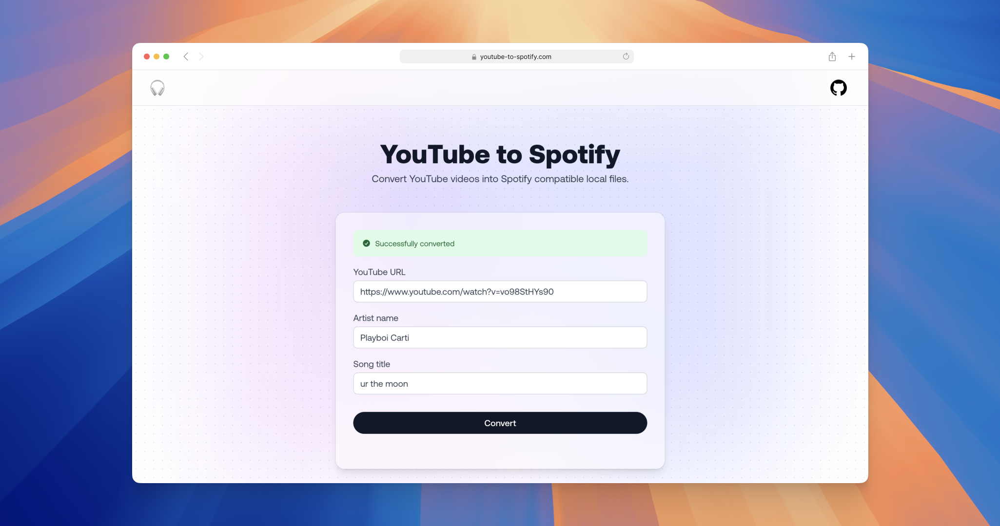
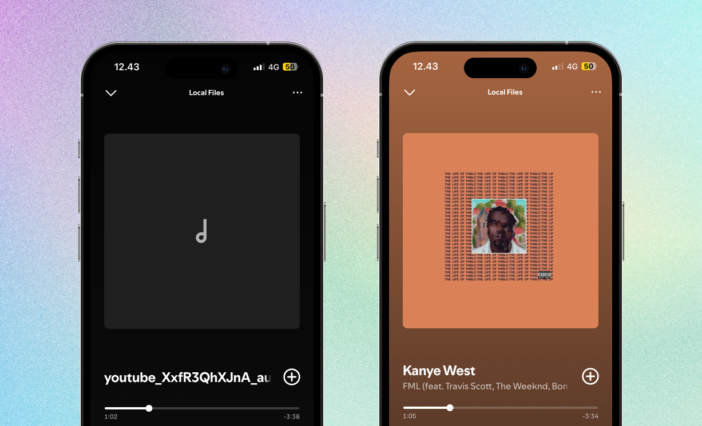

<div align="center">
  
  <h1>YouTube to Spotify</h1>
  <a href="https://github.com/hagelstam/yt-to-spotify/actions">
    
  </a>
 <a href="https://github.com/hagelstam/yt-to-spotify/actions">
    
  </a>
  <a href="https://github.com/hagelstam/yt-to-spotify/commits/main">
    
  </a>
</div>

### Screenshot



### About

Tool for downloading YouTube with rich metadata. Makes listening to songs with [Spotify local files](https://support.spotify.com/us/article/local-files/) a better experience, by embedding .mp3 files with artist name, song title and cover art metadata.



### Getting started

1. Make sure you have [Docker](https://www.docker.com/) and [Docker Compose](https://docs.docker.com/compose/) installed.

2. Build and run the frontend and backend containers:

```shell
docker compose up
```

3. Open `http://localhost:3000` in a browser.

### Built with

- [Go](https://go.dev/)
- [ffmpeg](https://www.ffmpeg.org/)
- [yt-dlp](https://github.com/yt-dlp/yt-dlp)
- [Astro](https://www.cockroachlabs.com/)
- [TailwindCSS](https://tailwindcss.com/)
- [Docker](https://www.docker.com/)

### License

This project is licensed under the terms of the [MIT](https://choosealicense.com/licenses/mit/) license.
